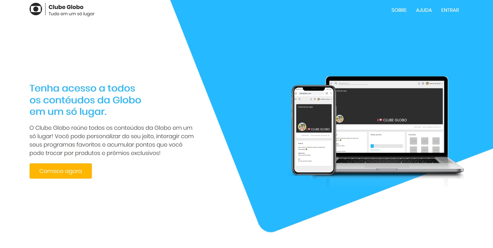

#### _Mega Hack 2º Edição_

📺 Clube Globo gathers all the contents of Globo in one place! You can customize it your way, interact with your favorite shows and collect points that you can exchange for exclusive products and prizes!

`Web preview`

## What is the Clube Globo?

Clube Globo is a club for Globo users to have the best experience, in a personalized way. The platform gathers all Globo content in a kind of menu, and has several interactions that accumulate points (GPontos) that can become prizes! When registering, the user indicates his / her tastes and preferences, and the system already personalizes the profile the user's way. And with a difference: it will have access to all content in one place, without having to migrate to other applications and sites to have access.

## Deployment in
http://clubeglobo.gabrieldesenvolvedor.com
If for some reason you are unable to create an account you can use the following information to sign in:
- Email: `teste@teste.com`
- Password: `123`

## Release history

* 0.1.0
    * Project finalized and studying the possibility of adding `new resources`
* 0.0.1
    * Work in `progress`
    
## Meta

Gabriel de Jesus – [Front-end Developer](https://www.gabrieldesenvolvedor.com/) – contato@gabrieldesenvolvedor.com

Distributed under the MIT License. See `LICENSE` for more information.

[https://github.com/devgabrieldejesus/clube-globo](https://github.com/devgabrieldejesus/)

## Contributing

1. Fork it (<https://github.com/devgabrieldejesus/clube-globo/fork>)
2. Create your feature branch (`git checkout -b feature/fooBar`)
3. Commit your changes (`git commit -am 'Add some fooBar'`)
4. Push to the branch (`git push origin feature/fooBar`)
5. Create a new Pull Request
